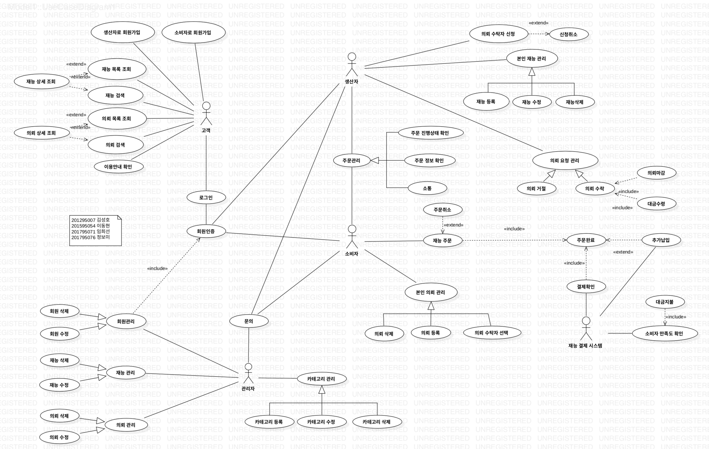

# software engineering

- customer: 고객
- admin : 관리자
- producer:생산자
- consumer: 소비자

## 재능상점
#### 개요
예술업계나 창의성을 요구하는 대부분 업무는 평가 기준이 모호하며, 개개인의 요구가 다양합니다. 이 때문에 많은 창작, 예술 업계에서는 생산자와 소비자의 요구가 서로 일치하지 않는 일이 빈번하게 발생합니다.
이러한 문제를 최소화하기 위하여, 소비자가 필요로 하는 재능과 그러한 재능을 가진 생산자를 서로 연결해주는 웹서비스 플랫폼을 구축합니다.

####  설계
- 관리자: devksh930
- 고객: HyeonProject
- 소비자: bomi94436
- 생산자: ImHuiSeon

### USECASE DIAGRAM

