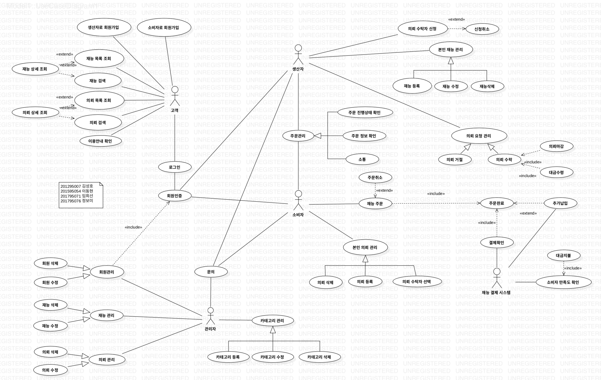

# software engineering

- customer: 고객
- admin : 관리자
- producer:생산자
- consumer: 소비자

## 재능상점

#### 개요
예술업계나 창의성을 요구하는 대부분 업무는 평가 기준이 모호하며, 개개인의 요구가 다양합니다. 이 때문에 많은 창작, 예술 업계에서는 생산자와 소비자의 요구가 서로 일치하지 않는 일이 빈번하게 발생합니다.
이러한 문제를 최소화하기 위하여, 소비자가 필요로 하는 재능과 그러한 재능을 가진 생산자를 서로 연결해주는 웹서비스 플랫폼을 구축합니다.

####  설계
- 관리자: <a href="http://github.com/devksh930">devksh930</a>-김성호
- 고객: <a href="http://github.com/HyeonProject">HyeonProject</a>-이동현
- 소비자:<a href="http://github.com/bomi94436"> bomi94436</a>-정보미
- 생산자:<a href="http://github.com/ImHuiSeon"> ImHuiSeon</a>-임희선

# USECASE DIAGRAM

#### 파일 목록
- <a href="https://github.com/devksh930/SW/tree/master/admin">ADMIN </a>: 관리자 유스케이스 목록 및 명세서
- <a href="https://github.com/devksh930/SW/tree/master/consumer">CONSUMER </a>: 소비자 유스케이스 목록 및 명세서
- <a href="https://github.com/devksh930/SW/tree/master/customer">CUSTOMER </a>: 고객 유스케이스 목록 및 명세서
- <a href="https://github.com/devksh930/SW/tree/master/producer">PRODUCER </a>: 생산자 유스케이스 목록 및 명세서
- <a href="https://github.com/devksh930/SW/tree/master/diagram">DIAGRAM  </a>: DIAGRAM(ACTIVITY, CLASS, ER, SEQUENCE, USECASE)
- <a href="https://github.com/devksh930/SW/tree/master/frontend">FRONTEND </a>: HTML , CSS 디자인
- <a href="https://github.com/devksh930/SW/tree/master/backend">BACKEND  </a>: JSP 기반  server 
- <a href="https://github.com/devksh930/SW/tree/master/report">REPORT  </a> : 테이블 기술서, 테스트케이스 , 최종보고서 

      <canvas width="735" height="604" style="z-index: 0; width: 735px; height: 604px; cursor: move;">
        
Sorry, your browser doesn’t support the &lt;canvas&gt; element.

        
Please upgrade to the latest <a href="https://www.microsoft.com/ie">Internet Explorer</a>, <a href="https://www.google.com/chrome">Chrome</a> or <a href="https://mozilla.org/firefox">Firefox</a>.

      </canvas>
      

        
      

    
